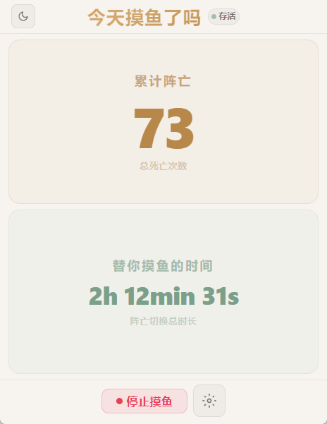

# 🔪 死了就摸鱼吧 — LoL Death Switch

> 英雄联盟阵亡后自动弹出视频窗口，抓紧每一秒摸鱼时间 🎮→📱
>
> 复活后自动暂停视频并切回游戏——全程零操作。

<p align="center">
  
</p>

## ✨ 功能

- **阵亡自动摸鱼** — 检测到阵亡后自动弹出视频窗口（抖音/B站/自定义URL）
- **复活自动切回** — 复活瞬间暂停视频、最小化窗口、恢复游戏前台
- **视频播放控制** — 播放/暂停幂等操作：手动暂停后复活不会误播，再次阵亡自动续播
- **内嵌视频窗口** — 零外部依赖，Electron 自有 BrowserWindow，不依赖 Chrome/Edge/Firefox
- **自定义跳转** — 支持添加任意网址 + 备注名称，下拉框直观选择
- **系统托盘** — 关闭窗口后后台运行，托盘图标常驻
- **数据统计** — 累计阵亡次数、AFK 总时长，持久化保存
- **LoL 主题 UI** — 英雄联盟暗金风格界面

## 📸 截图


## 🔧 技术栈

| 层 | 技术 |
|---|---|
| 桌面框架 | Electron 30 |
| 前端 | React 18 + Vite 5 |
| UI | MUI 5 + Tailwind CSS 3 |
| 游戏交互 | PowerShell + C# Win32 API（SetForegroundWindow） |
| 打包 | electron-builder (NSIS) |

## 🚀 快速开始

### 环境要求

- Windows 10/11
- Node.js >= 18
- 英雄联盟客户端（运行时需开启游戏）

### 安装

```bash
git clone https://github.com/你的用户名/lol-death-switch.git
cd lol-death-switch
npm install
```

### 开发模式

```bash
# 启动 Electron + Vite 热更新
npm run electron:dev

# 视频窗口 Smoke Test（不依赖游戏，验证视频控制逻辑）
npm run smoke-test
```

### 打包构建

```bash
npm run electron:build
```

构建产物在 `release/` 目录下，生成 NSIS 安装包（`.exe`）。

## ⚙️ 工作原理

```
LoL 客户端 ──→ 本地 API (127.0.0.1:2999)
                    │
                    ↓ 每秒轮询
              lol-monitor.cjs
               ├── 检测 currentHealth ≤ 0 / isDead
               └── 防抖 (wasDead 状态追踪)
                    │
         ┌──────────┼──────────┐
         ↓                     ↓
    阵亡事件                复活事件
         │                     │
         ↓                     ↓
  main.cjs                main.cjs
   ├─ saveGameWindow()      ├─ pauseVideo()
   ├─ createVideoWindow()   ├─ hideVideoWindow()
   ├─ playVideo()           └─ restoreGameWindow()
   └─ showVideoWindow()          (C# Alt+SetForegroundWindow)
         │
         ↓
  Electron BrowserWindow
   └─ executeJavaScript('v.play()')
```

## 📂 项目结构

```
lol-death-switch/
├── electron/                  # Electron 主进程 (CommonJS)
│   ├── main.cjs               # 窗口管理 + IPC + 视频窗口 + C# 互操作
│   ├── preload.cjs            # contextBridge 安全桥接
│   ├── lol-monitor.cjs        # LoL 本地 API 轮询 + 阵亡/复活检测
│   └── smoke-test.cjs         # 视频窗口独立测试脚本
├── src/                       # React 渲染进程 (ESM)
│   ├── App.jsx                # 主应用 + 状态管理 + IPC 通信
│   ├── main.jsx               # React 入口
│   ├── theme.js               # LoL 暗金主题 (MUI)
│   ├── index.css              # 全局样式 + Tailwind + 动画
│   └── components/
│       ├── ConfigPanel.jsx    # 配置面板（目标选择 + 管理入口）
│       ├── UrlManager.jsx     # 自定义 URL 管理页
│       ├── StatusPanel.jsx    # 状态面板 + 启动/停止按钮
│       ├── DeathCounter.jsx   # 阵亡计数大字
│       ├── StatsPanel.jsx     # 数据统计面板
│       └── CloseDialog.jsx    # 自定义关闭对话框（退出/托盘）
├── assets/                    # 图标 + 截图
│   ├── icon.ico               # 应用图标 (Windows)
│   ├── icon.png               # 应用图标 (通用)
│   ├── icon.svg               # 应用图标 (矢量)
│   └── screenshots/
│       └── app-screenshot.png # 应用截图
├── index.html                 # Vite HTML 入口
├── vite.config.js             # Vite 配置
├── tailwind.config.js         # Tailwind 配置
└── package.json               # 项目配置 + electron-builder
```

## 🎮 使用方式

1. 启动英雄联盟，进入对局
2. 打开本应用，点击 **"开始监控"**
3. 阵亡 → 视频窗口弹出，自动播放
4. 复活 → 视频暂停，自动切回游戏
5. 关闭窗口 → 默认隐藏到系统托盘，后台持续监控

## ⚠️ 注意事项

- **仅支持 Windows** — 使用了 PowerShell + Win32 API 实现游戏窗口切换
- 需要英雄联盟客户端**正在对局中**才能检测到游戏状态
- LoL 本地 API 使用自签名证书，应用已配置 `rejectUnauthorized: false`
- 视频窗口使用 Electron 内嵌 Chromium，不依赖系统浏览器，且与浏览器 Cookie 隔离

## 📄 License

MIT
